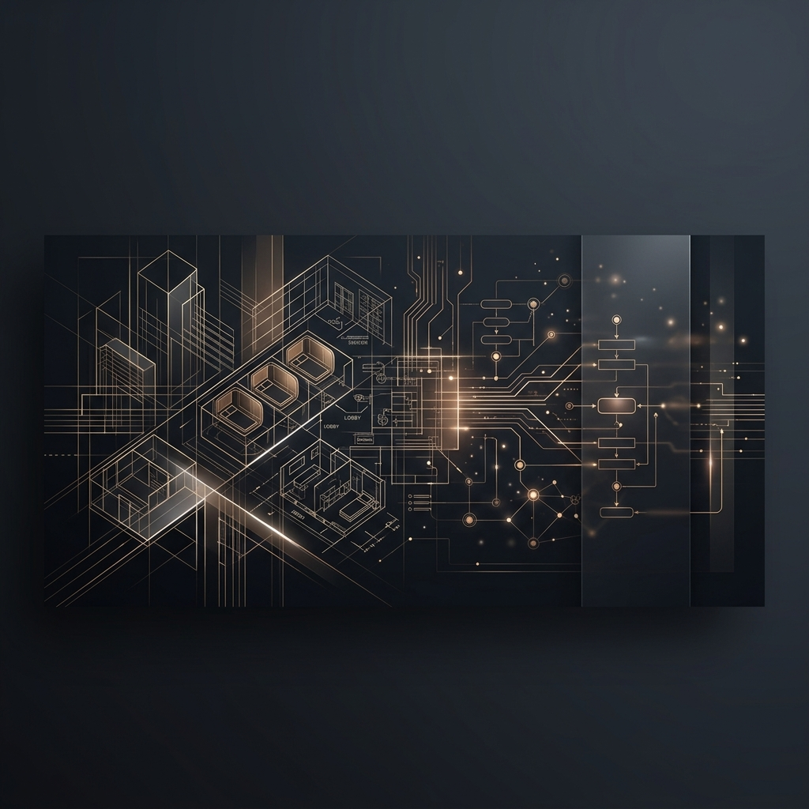

<div align="center">
  
</div>

<br />

<div align="center">
  <h1>👋 Hi, I'm Hadi Irvani</h1>
  <p><strong>Founder & Managing Partner @ Infill Capital Partners & Lume Hotels</strong></p>
  <p>
    <a href="https://www.linkedin.com/in/hadi1/"></a>
    
    
  </p>
</div>

---

### 💻 Profile & Narrative
I am an **entrepreneur, growth architect, and systems engineer** operating at the intersection of **Real Estate Private Equity, Hospitality, and Intelligent Automation.** 

Over the last 15+ years, I have built and scaled execution-heavy businesses from **$0 ⮕ $8M+ in ARR**, leading teams of 60+ operators, and architecting high-concurrency cloud systems. Today, I apply these technical engineering paradigms to modernize real estate acquisitions, hospitality operations, and deal underwriting.

---

### 🏢 Current Ventures

<table>
  <tr>
    <td width="50%" valign="top">
      <h4>🏢 <a href="https://infillcapitalpartners.com">Infill Capital Partners</a></h4>
      <p>A pan-European real estate private equity firm utilizing a sophisticated <strong>PropCo-OpCo</strong> model to acquire underutilized urban infill assets and convert them into premium, design-led lifestyle hospitality spaces across London, Paris, and Milan.</p>
    </td>
    <td width="50%" valign="top">
      <h4>🛏️ <a href="https://lumehotels.com">Lume Hotels</a></h4>
      <p>A premium, tech-forward capsule hospitality platform. We leverage custom hardware, smart automation, and precise spatial layouts to deliver state-of-the-art guest experiences and operational efficiency in high-barrier European gateway cities.</p>
    </td>
  </tr>
  <tr>
    <td width="50%" valign="top">
      <h4>⚙️ GravityClaw (Private)</h4>
      <p>My proprietary <strong>Mission Control AI Layer</strong> that orchestrates personal logistics, European deal sourcing, underwriting data consolidation, and workflow automation to maximize execution leverage and speed.</p>
    </td>
    <td width="50%" valign="top">
      <h4>📦 Open-Source & Tech Ops</h4>
      <p>Active maintainer of infrastructure and pipeline configurations (e.g., <a href="https://github.com/alvinunreal/oh-my-opencode-slim">oh-my-opencode-slim</a>) and builder of spatial analytics models for real estate deal screening.</p>
    </td>
  </tr>
</table>

---

### 🛠️ Execution Stack

To keep my profiles clean and visually harmonious, my technical stack is curated in a unified palette matching the midnight slate and metallic gold aesthetic:

```yaml
Architecture:  [Play Framework, Scala, Node.js, Python, Docker]
Cloud & Infra: [AWS (Featured Developer), Serverless, Terraform, Pi-hole]
AI & Automation:[Autonomous Agents, LangChain, Custom LLM Orchestration, GravityClaw SDK]
Operations:    [PropCo-OpCo Modeling, Yield Management SOPs, Real Estate Underwriting]
```

<div align="left">
  
  
  
  
  
  
  
</div>

---

### 📊 GitHub Activity & Metrics

<div align="center">
  <table border="0">
    <tr>
      <td align="center" valign="middle">
        
      </td>
      <td align="center" valign="middle">
        
      </td>
    </tr>
  </table>
</div>

---

### 🤝 Strategic Opportunities & Mentorship
* **Joint Ventures:** I'm always open to discussing partnerships with landlords, institutional operators, and equity allocators for hospitality conversions in Europe.
* **Technical Talents:** Seeking top-tier full-stack engineers, AI builders, and UI/UX visual designers to work on our hospitality and investment tech stack.
* **Entrepreneurs Organization (EO):** Active mentor advising early-stage and mid-market founders on operational scaling, cash flow modeling, and technical transitions.

<div align="center">
  <p><strong>"Clear strategy ⮕ Fast execution. Simple systems that scale."</strong></p>
  <a href="https://infillcapitalpartners.com"></a>
  <a href="https://lumehotels.com"></a>
  <a href="https://www.linkedin.com/in/hadi1/"></a>
</div>
